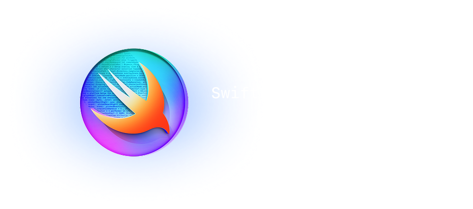

# Mealke

  

🇺🇸 [English Version]\(https://github.com/educcamara/Orbities)

## Sobre

  

Uma das minhas grandes paixões é cozinhar, preparar marmitas e tirar bom proevito dos ingredientes que tenho na prateleira. Com o tempo, notei que era desafiador manter meus estoques organizados, planejar refeições de forma consistente e, principalmente, evitar o desperdício de alimentos.

Foi daí que surgiu a ideia de criar o **Mealke**, um aplicativo pensado para me ajudar a gerenciar ingredientes, estruturar minhas refeições e reduzir perdas. Ele funciona como um hub simples, no qual é possível registrar cada item com sua data de validade enquanto, simultaneamente, se planeja e acompanha o preparo das refeições.

**Funcionalidades principais:**

Acompanhamento de Armazenamento de Alimentos:
- Registre itens da despensa, geladeira ou freezer para controlar o que está disponível
- Atribua datas de validade aos itens e evite desperdício
- Visualize os itens armazenados organizados por categorias
- Acompanhe múltiplos lotes do mesmo alimento com datas de validade ou quantidades diferentes

Acompanhamento de Refeições:
- Planeje refeições selecionando ingredientes e registrando as quantidades utilizadas
- Registre o preparo das refeições para saber o que foi preparado e armazenado em cada local
- Registre café da manhã, almoço, jantar ou lanches a qualquer momento
- Acompanhe quais ingredientes foram usados em cada refeição
- Mantenha um histórico claro do seu consumo com um panorama semanal de refeições

## Tecnologias e Coisas

- Aplicativo feito em Swift
- Frontend modelado em SwiftUI
- Persistência de dados local com SwiftData
- TipKit para introdução de funcionalidades no aplicativo
- GitFlow + Conventional Commits no fluxo de trabalho com Git
- Testes unitários com XCTest para migração de esquemas em SwiftData

### MVVM no SwiftUI

Aplicação do padrão **MVVM** na camada de front-end com SwiftUI, separando Views da lógica de negócio e garantindo que cada tela seja guiada por um ViewModel claro, com estados e efeitos bem definidos.

### SwiftData para Persistência Local

Criação de uma entidade que contém as configurações e o contexto das tabelas do SwiftData, possuindo operações genéricas de CRUD para facilitar a manipulação dos dados.

Além disso, a configuração do esquema foi feito por `VersionedSchemas`, permitindo migração de esquemas de forma segura para versões em produção.

### TipKit para Funcionalidades

Implementação do **TipKit** para introdução de funcionalidades no aplicativo, guiando o usuário por meio de dicas contextuais que melhoram a experiência de uso e ajudam na descoberta de recursos.

### Testes Unitários com XCTest

Desenvolvimento de testes unitários utilizando o framework **XCTest** para garantir a integridade das operações de migração de esquemas no SwiftData, assegurando que os dados sejam preservados corretamente durante atualizações do aplicativo.